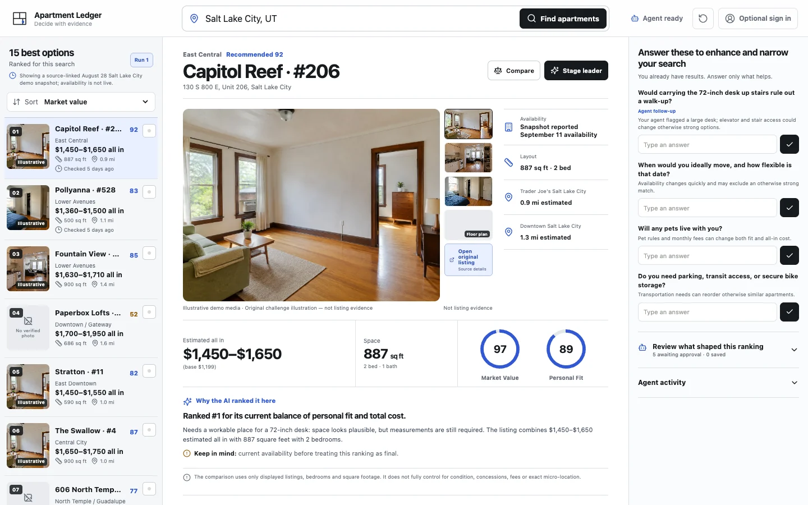

# Apartment Ledger

An agent-native apartment decision workspace for the OpenAI WebMCP Challenge.

**Live demo:** [apartmentledger.vercel.app](https://apartmentledger.vercel.app/)



The renter's personal agent brings only the context it chooses to share. The page turns that context into visible assumptions, a ranked preliminary shortlist, transparent market-value and personal-fit reasoning, refinement questions, comparisons, and a reversible staged decision.

## Product boundary

- Complete anonymous experience; sign-in is not required.
- Familiar rental controls cover whole places, private rooms, shared rooms, all-in budget, bedrooms, and move timing; an agent can prefill every field for review through WebMCP.
- Results before questionnaire: a location is enough to produce a preliminary shortlist.
- Deterministic unanswered questions and agent-supplied custom follow-ups can refine the shortlist without blocking the first result set.
- Explicit numbered reruns preserve the original ranking and explain what changed.
- A built-in Google Maps preview shows the listing against selected location anchors; renters can add another place, open a live Google route, and sort by anchors with verified coordinates.
- Preferences and location anchors are visibly attributed and require approval before durable saving.
- Apartment-relevant context shared for the current run stays visible in page state but is excluded from anonymous browser persistence.
- Market Value Score and Personal Fit Score remain separate.
- The default Recommended score is their transparent equal-weight mean.
- No applications, bookings, landlord messages, payments, or lease commitments.
- No claim of access to a user's complete ChatGPT memory.
- Original illustrative challenge media is progressively disclosed and explicitly labeled as not being listing evidence; factual listing evidence remains source-linked and useful without media.

## WebMCP tools

The application registers eight imperative browser tools through `@nekuda/webmcp-sdk`, which targets the native `document.modelContext.registerTool(...)` surface:

1. `prepare_search`
2. `review_workspace`
3. `propose_preferences`
4. `search_candidates`
5. `organize_results`
6. `add_candidate`
7. `compare_candidates`
8. `stage_decision`

Every tool calls the same page-owned domain actions as the human interface and produces a visible page effect.

## Local development

```bash
npm install
npm run dev
```

The deterministic Salt Lake City demo does not require credentials.

It reuses the personal shortlist's keyless Google map-preview pattern. For the supported production embed and in-page directions mode, configure a website-restricted `VITE_GOOGLE_MAPS_EMBED_API_KEY`; Google Maps links themselves do not require a key.

```bash
npm test
npm run typecheck
npm run lint
npm run build
npm run benchmark:media
```

With the app running at `http://127.0.0.1:4173`, Chrome 150+ can execute the native browser verification:

```bash
npm run qa
```

The QA pass discovers and invokes all eight WebMCP tools in an isolated anonymous workspace, verifies visible UI effects, checks persistence and responsive rendering, captures desktop plus all three mobile workspace sections, and fails on browser console errors.

The media benchmark opens fresh browser contexts and measures the non-blocking sequence from visible results to the lead image, the first five shortlist images, progressively released ranks 6–10, and a visible refinement rerun.

## Optional nationwide provider

Live nationwide search is disabled by default. Copy `.env.example`, apply `db/001_provider_budget_and_cache.sql` to a dedicated Neon database, and configure the RentCast variables only when ready.

The live adapter:

- requires an atomic database reservation before each uncached RentCast request;
- defaults to 45 requests per month, below the 50-request free allocation;
- caches normalized searches;
- returns an honest demo fallback when unavailable;
- exposes no browser credentials;
- does not pretend RentCast supplies photos or original listing links.

## Submission status

The local product, deterministic demo, submission copy, judge guide, demo script, and verification harness are complete. Typecheck, lint, 42 tests, production build, native Chrome WebMCP execution, and the full npm security audit pass.

Challenge-period implementation evidence is documented in [`docs/CHALLENGE_BUILD.md`](docs/CHALLENGE_BUILD.md). Judge instructions are in [`docs/JUDGE_GUIDE.md`](docs/JUDGE_GUIDE.md). This repository is licensed under the [MIT License](LICENSE).

The public repository and production Vercel deployment are live. Enabling paid providers, recording/uploading the demo video, and submitting the Devpost entry remain separate approval-time actions.
